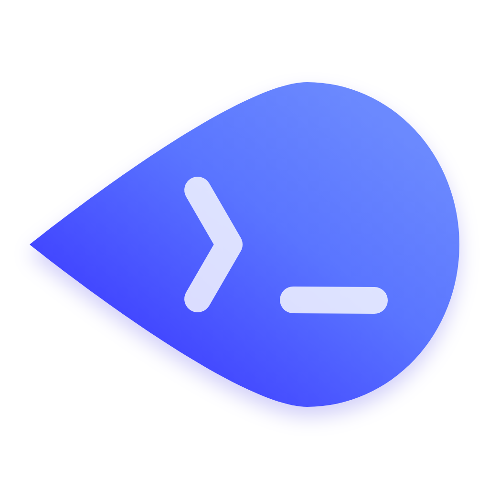

<div align="center">
  

  <h1>OpenTerm</h1>

  <p>
    <strong>A multi-terminal management Agent for local machines, remote hosts, CLI tools, file transfer, and port forwarding.</strong>
  </p>

  <p>
    <strong>面向本机、远程主机、CLI 工具、文件传输和端口映射的多终端管理 Agent。</strong>
  </p>

  <p>
    <a href="docs/README.en.md">English</a> |
    <a href="docs/README.zh-CN.md">中文</a> |
    <a href="docs/README.en.md">Documents</a> |
    <a href="docs/development.md">Development</a> |
    <a href="docs/testing.md">Testing</a> |
    <a href="docs/feedback.md">Feedback</a>
  </p>

  <p>
    <a href="LICENSE"></a>
    
    
    
    
  </p>

  <p>
    <a href="CODE_OF_CONDUCT.md">Code of Conduct</a> |
    <a href="CONTRIBUTING.md">Contributing</a> |
    <a href="SECURITY.md">Security</a> |
    <a href="LICENSE">AGPL-3.0 license</a>
  </p>
</div>

---

## What Is OpenTerm?

OpenTerm is a desktop workspace for people who live in terminals. It brings together local terminals, remote hosts, file transfer, port forwarding, model/provider configuration, and an AI Agent that can co-drive real terminal sessions with you.

Many developers already have a large collection of CLI tools on their machines: Codex, Claude Code, OpenCode, OpenClaw, package managers, cloud CLIs, build tools, deployment scripts, and custom automation. The hard part is rarely one single command. It is switching between terminal windows, keeping context, configuring environments, connecting to remote machines, watching output, fixing failures, and continuing the next step without losing the thread.

OpenTerm is built for that workflow. The Agent can operate across multiple terminal sessions, observe command output, help configure tools, debug failures, and continue work in a shared co-driving terminal. You stay in control, and you can pause, take over, or use OpenTerm as a traditional terminal whenever you want.

## Demo

This demo shows the Agent co-driving a terminal workflow: it observes the workspace, runs commands, reacts to output, and keeps the process visible while you stay in control.

https://github.com/user-attachments/assets/7f0d3f04-5f7c-4062-9a1a-3e102b5a5a29

[Watch the demo video](docs/assets/readme/demo.mp4)

## Highlights

- **Multi-terminal workspace**: Manage local and remote terminal sessions in one place.
- **Agent co-driving terminal**: Let the Agent execute commands, inspect output, and continue the workflow while you remain in control.
- **CLI tool orchestration**: Drive tools such as Codex, Claude Code, OpenCode, OpenClaw, package managers, cloud CLIs, and project scripts.
- **Remote host workflow**: Connect to hosts over SSH and keep terminal context organized by task.
- **Traditional terminal support**: Use OpenTerm as a normal terminal when you want direct manual control.
- **File transfer and browsing**: Browse remote files, upload, download, and move through file workflows without leaving the workspace.
- **Port forwarding**: Create and manage convenient tunnels for remote services and local previews.
- **Provider and model settings**: Configure AI providers, models, and connection checks from one place.
- **Task memory and context**: Keep task, host, terminal, and execution history connected so the Agent can continue more reliably.

## Who Is It For?

OpenTerm is for developers, operators, and AI-tool power users who:

- keep many terminals open for frontend, backend, databases, logs, builds, and deploy scripts;
- often ask AI tools to install CLIs, fix environments, run commands, or diagnose failures;
- switch between local and remote machines during one task;
- want an Agent that feels closer to a remote collaborator than a detached chat window;
- still want the directness and control of a real terminal.

## Documentation

- [中文文档](docs/README.zh-CN.md)
- [English documentation](docs/README.en.md)
- [Development guide](docs/development.md)
- [Testing guide](docs/testing.md)
- [Feedback guide](docs/feedback.md)
- [Contributing](CONTRIBUTING.md)
- [Security policy](SECURITY.md)

## Quick Start

Install dependencies:

```bash
npm install
```

Start the development app:

```bash
npm run dev
```

Run type checks:

```bash
npm run typecheck
```

Run tests:

```bash
npm test
```

## Build

Build for the current platform:

```bash
npm run build
```

Build platform-specific packages:

```bash
npm run build:mac
npm run build:win
npm run build:linux
```

## Safety And Control

OpenTerm is designed to enhance terminal workflows, not to blindly run everything on your behalf. Agent actions should remain observable, pausable, and easy to take over. For commands that change system state, touch sensitive configuration, or affect remote services, review the context and goal before execution.

## License

OpenTerm is licensed under [AGPL-3.0-only](LICENSE).
